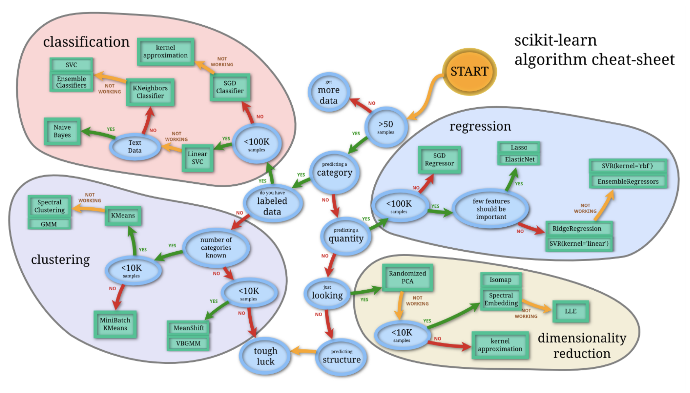
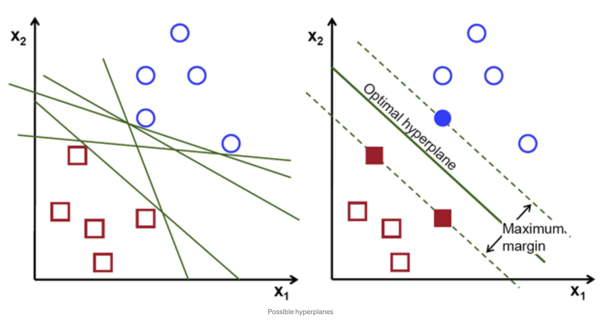
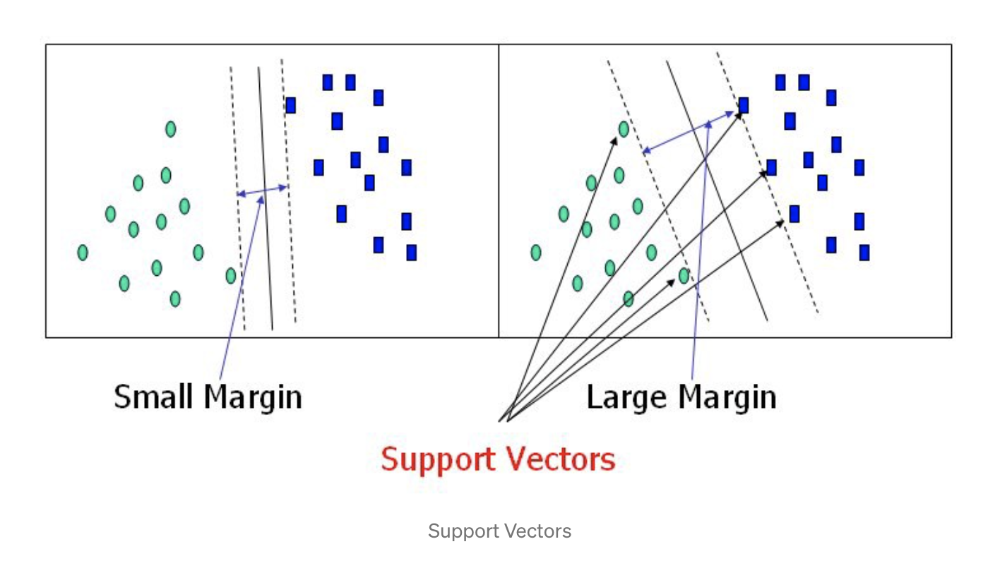
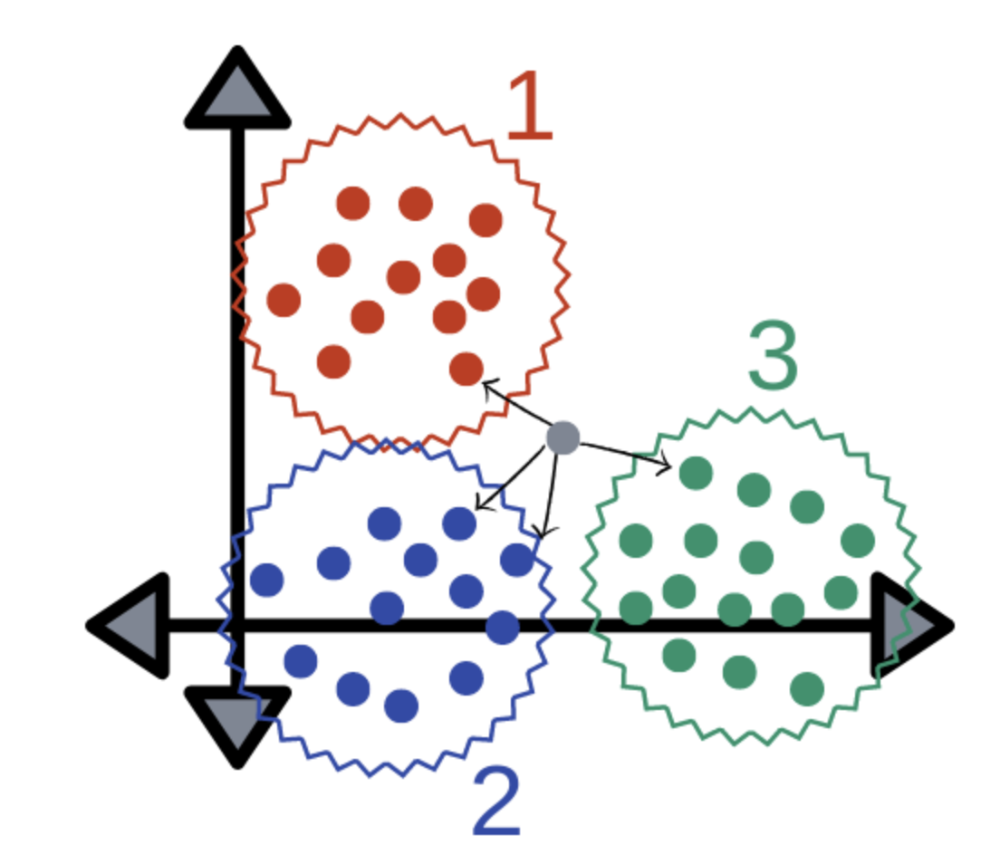
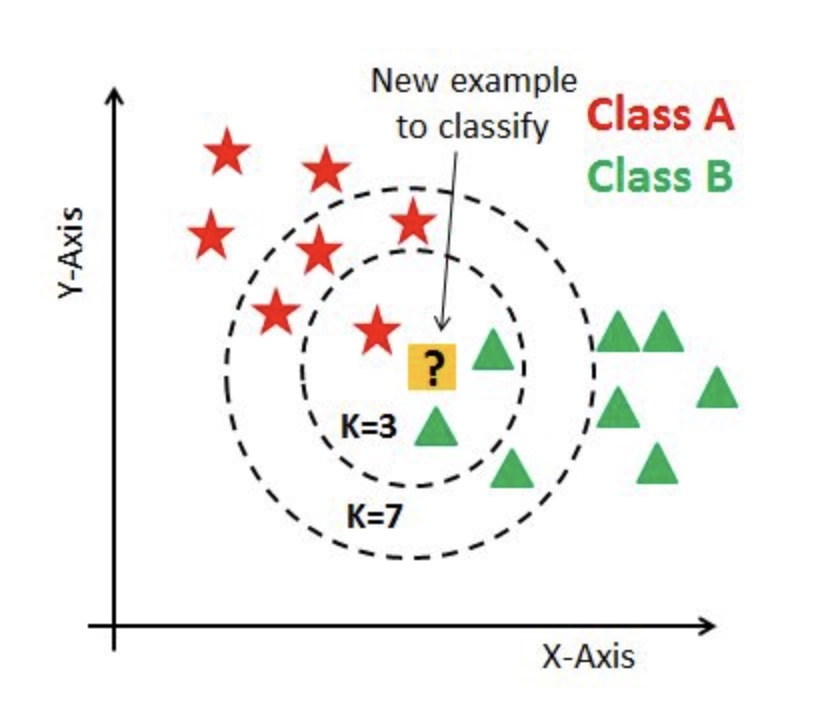

```{r setup, include=FALSE}
knitr::opts_chunk$set(echo = TRUE)
library(yaml)
```

# Purpose of this Project
> "Numbers have an important story to tell. They rely on you to give them a voice" -Stephen Few

This project aims to discover a machine learning algorithm discussed within our Data Science 4001 class. Through the completion of this project, the goal is to obtain a detailed knowledge of one of the topics as well as tell an important story of the results. Although the analysis itself is essential, the ability to interpret the results efficiently and successfully is vital. The aim through this project is to successfully create two Machine Learning models and effectively tell an un-biased 'story' or conclusion with our findings.

# Brief Background on Diabetes
Diabetes is a chronic health condition that inhibits the normal function of the body's insulin production and intake. This results in abnormal breakdown of carbohydrates and elevated levels of glucose within the blood and urine. Diabetes can lead to many complications including blindness, kidney failure, heart attacks, stroke, and lower limb amputation.(World Health Organization)

In the United States alone, there are more than 34 million individuals who have diabetes. More significantly, there are more than 88 million individuals who are pre-diabetic. This disease is the seventh leading cause of death in the United States, and the prevalence of the disease keeps increasing significantly worldwide. Specifically, the number of individuals in low- and middle-income countries is rapidly rising compared to high-income countries. (CDC)

There are two types of diabetes, Type 1 and Type 2. Type 1 is described by "deficient insulin production and requires daily administration of insulin." On the other hand, Type 2 is said to result from "the body’s ineffective use of insulin." Type 2 diabetes is more common within adults or individuals who are overweight or have low physical activity. (CDC)

Understanding the different medical predictors that can lead to diabetes can help individuals educate themselves to take the precautions necessary to avoid becoming pre-diabetic or diabetic. This is especially important for those who may become victim to Type 2 Diabetes in their lifetime. This analysis will look for some of those medical predictors to see their significance with the outcome of diabetes.

# About Pima Indians
There have been a plethora of studies analyzing Type 2 Diabetes; however, because the disease is so multi-faceted, researchers have been using specific approaches to reduce the "complexity" of the disease by studying a population that has limited genetic and environmental variability (Reference 3). A population that fits this description is the Pima Indians of Arizona; another factor that is useful of this population is that they are said to have the "highest reported prevalence of diabetes [specifically Type 2 Diabetes] of any population in the world" (Reference 3). There have been multiple genetic studies conducted to identify susceptibility genes in Pima Indians.  

Although the dataset we are utilizing does not claim that the patients only have Type 2 Diabetes and that the Pima Indian group was selected due to genetic and environmental advantages, it can be assumed that this is likely the case. By analyzing a sample of a population that has limited genetic and environmental variability (as well as a restriction on age), our results are more specific to the factors that lead to diabetes that are not related to other health concerns. It is, therefore, imperative to look at our results from a perspective that acknowledges this claim. The more knowledgeable one is about the dataset and where it comes from, the better and less biased the analysis/results will be.

# About the Dataset

```{r, include=FALSE}
df <- read.csv("diabetes.csv")
nrow(df)
```
Before selecting a machine learning algorithm, having a clear understanding of the data is critical. We must familiarize ourselves with the origin, size, key characteristics, behavior, and type of data. 

The selected dataset for this project is original from the National Institute of Diabetes and Digestive and Kidney Diseases but can also be found on Kaggle  [here](https://www.kaggle.com/uciml/pima-indians-diabetes-database). 

The dataset is composed of eight medical predictor variables and one target variable, Outcome. The medical predictor variables include number of pregnancies, blood pressure, BMI, insulin levels, age, skin thickness, diabetes pedigree, and age. There are 768 observations or patients (in this case). All of these observations are for women ages 21 and up of Pima Indian heritage. Therefore, gender will not be a variable considered for this analysis. Because several constraints were placed on the selection of these patients, the data being analyzed is considered a sample; if it had been representative of all of the Pima Indians, then it would have been considered a population.

# Data Cleaning
```{r}
str(df)
df$Outcome <- factor(df$Outcome) #change Outcome to a factor with levels 0 and 1
summary(df)
```
Looking at the structure of the dataframe, the Outcome column is seen as an integer value; this must be modified to be levels of 0 representing "tested negative for diabetes" and 1 representing "tested positive for diabetes."

```{r}
df[, 3:7][df[, 3:7] == 0] <- NA #assign column's with 0's a value of NA
df<- na.omit(df)    #remove NA's           
```
Looking at the structure of the data, the data appears to have no NA's present. However, there are certain medical predictor variables with values equal to 0. For example, Blood Pressure, Skin Thickness, BMI, and Insulin should realistically not ever be 0. Therefore, it can be assumed that these biological measurements must be removed as they are not meaningful.

```{r}
nrow(df) #checking size of the new df
```
With these modifications, the dataset is restricted to 393 observations/patients. Understanding the size and structure of the dataset allows for the best selection of the Machine Learning Algorithm that will be implemented.



# Selecting ML Algorithm 
Multiple factors were in consideration to determine the best machine learning algorithm for the given dataset. After exploratory data analysis, the appropriate machine learning algorithm was determined with the help of the graphic above. Since the data is predicting a category (whether someone is diabetic or not), the data is labeled, and we have less than a thousand observations, we can utilize a Support Vector Machine as our classification algorithm. Although we have not discussed this algorithm in class, we will go into detail about the algorithm and the steps necessary to create our model.

Our group also decided to include a K-Nearest Neighbors Model as this algorithm is also appropriate for out dataset. In fact, the graphic above points to KNN as an alternative to SVM. This is a model we learned about in class; therefore, we felt that including it would be beneficial in showcasing our understanding of the DS 4001 Material.


# High Level Description of SVM



**Objective of SVM**: The goal of the Support Vector Machine algorithm is to determine a hyperplane in an N-dimensional space that distinctly classifies the data points. **Note: Hyperplanes can be a line or a plane depending on how many variables are being analyzed**

Support Vector Machine (SVM) is a **supervised** type of machine learning algorithm that can be used for both regression and classification models (although, it is often more preferred for classification). It looks at the extremes of a dataset and draws a decision boundary (aka hyperplane). By creating this hyperplane, the SVM allows for the segregation between two classes. For this project, the two segregated groups are patients with diabetes and those without diabetes. 

SVM aims to maximize the margin-- maximum distance between data points of both classes--when successfully running the algorithm. However, often with SVM, there is a trade-off between bias and variance when a hyper-plane boundary is created between the types of data. In certain cases, if we have found the largest margin, we are using what is called the **Maximal Margin Classifier**. However, this is super sensitive to outliers in the training data. If instead we use a threshold that is not as sensitive to outliers, then we are using what is called the **Soft Margin**. 


Here, our support vectors are the data points that are found to be closest to the hyperplane and influence the position/orientation of the hyperplane. These points are critical as they help build the SVM model by maximizing the margin of the classifier; if these points were to be deleted, the position of the hyperplane would be modified as a result.

# SVM Pro/Con {.tabset}

## Some Advantages of SVM
- Scales well to high dimensional data  
- SVM models have generalization in practice, therefore reducing the risk of over-fitting  
- Uses the kernel trick   
- Unlike in neural networks, SVM is not solved for local optima  
 
## Some Disadvantages of SVM 
- Long training time for larger datasets  
- Can be difficult to understand and interpret the final model  
- The SVM hyper parameters are Cost -C and gamma. It is not that easy to fine-tune these hyper-parameters and is hard to visualize their impact  


# SVM Model {.tabset}

## Looking at the Target Variable (Outcome)
```{r}
class(df$Outcome)
```
The 'Outcome' column is already a class of type 'factor', therefore we do not need to modify it and can move forward with our machine learning algorithm. It is important to note that 1's represent patients with diabetes whereas 0's represent patients without diabetes.

## Creating Training and Test Set
```{r}
# Splitting the dataset into the Training set and Test set 
#install.packages('caTools') 
library(caTools) 
  
set.seed(03092000)

# Creating a 70/30 split
splitting_data <- sample(1:nrow(df),
               round(0.7 * nrow(df), 0), 
               replace = FALSE)

#Creating the train and test data
svm_train <- df[splitting_data, ] #Should contain 70% of data points
svm_test <- df[-splitting_data, ] #Should contain 30% of data points

#Checking to ensure steps above were done correctly
size_of_training <- nrow(svm_train)
size_of_total <- nrow(df)
size_of_test <- nrow(svm_test)

#Verification
paste("The Training Set contains", toString(round(size_of_training/size_of_total,2)*100), "% of the total data")
paste("The Testing Set contains", toString(round(size_of_test/size_of_total,2)*100), "% of the total data")
```
For the model, we decided to stick to a 70/30 split for the training vs testing data set size.

## Scaling Training and Test Set
```{r}
# Feature Scaling 
svm_train[-9] = scale(svm_train[-9]) 
svm_test[-9] = scale(svm_test[-9])
```
Scaling is one of the most important steps in the pre-processing of the data. By scaling, data scientist are able to normalize the range of independent variables (features) of data. For example, this is extremely important in cases where the data may have an outlier that is large in magnitude; scaling, in this sense, allows the model to remain unimpaired. 

Feature scaling can be the determining factor between a weak machine learning model and a strong machine learning model. Therefore, it is imperative to scale for certain machine learning algorithms. With the feature scaling complete, we proceed with our analysis.


## Fitting SVM to the Training Set 
```{r}
#install.packages('e1071') 
library(e1071) 
  
classifier <- svm(formula = Outcome ~ ., 
                 data = svm_train, 
                 type = 'C-classification',  #Default
                 kernel = 'linear')  #The kernel used in training and predicting
```

## Predicting the Test Set Results with Model
```{r}
# Predicting the test set results 
y_pred <- predict(classifier, newdata = svm_test[-9]) 
```

## Creating Confusion Matrix
```{r}
# Making a Confusion Matrix 
#install.packages("caret")
library(caret)
cm <- confusionMatrix(svm_test$Outcome,y_pred, positive = "1")
cm
```
After creating our confusion matrix, we can see that our **accuracy** for the model is **76.27%**, which means that the model is performing moderately well. We can then look at the **specificity** value of **62.86%**, which tells us the true negative rate. This means that our model identifies patients without diabetes correctly 62.86% of the time. Similarly, we can look at the **sensitivity** value of **81.93%**, which tells us the true positive rate. This means that we identify patients with diabetes correctly 81.93% of the time.Specificity and sensitivity are important in our analysis as they are values that we care about optimizing. The higher both of these values are, the better our model is at predicting patients who are diabetic and those who are not. 

[ add perhaps more text here explaining significance, is our p value a bad indication (text me about this)]

## SVM Conclusion
```{r}

```


# High Level Description of KNN

**Objective of KNN**: Makes the assumption that similar things exist in close proximity. By using this concept, the algorithm predicts the grouping an input belongs to by looking at the "k" closest data points (also known as neighbors).


KNN is a **supervised** algorithm used in machine learning; it is considered both **non-parametric** and **lazy** (makes no generalizations). KNN works by trying to classify a given data point to the points already existing in the dataset. It compares the input to all of the nearest points surrounding it, and determines its classification based on which point it is closest/most similar to. KNN mainly involves two hyperparameters, K value & distance function. The graphic above shows a very basic example of how this algorithm functions.

# KNN Pro/Con {.tabset}

## Some Advantages of KNN
- Easy to interpret and explain results  
- Training time is relatively fast  
- Simple/fast to deploy  
- Can handle multi-class datasets  
- Non-parametric  (makes no explicit assumptions about the underlying distribution of the input)
 
## Some Disadvantages of KNN 
- Although little to no training time, uses up a lot of disk space  
- Works best with 25 or fewer dimensions  
- Can be seen as impractical in industry settings  
- Data must be normalized before beginning analysis
  - Frequency of a class/category can dominate the majority vote


# KNN Model {.tabset}

## Splitting and Calculating Base Rate 
```{r}
#Determine the split between diabetic and not diabetic then calculate the base rate
split <- table(df$Outcome)
non_diab <- split[1] / sum(split) #0 represents not diabetic (negative for diabetes)
diab <- split[2] / sum(split) #1 represents diabetic (positive for diabetes)
data.frame(c('Diabetic' = diab,'Not Diabetic' = non_diab))
```
Looking at the base rates, we can see that about **33.1%** of our dataset is made up of patients who are **diabetic** and **66.9%** of our dataset is made up of patients who are **not diabetic**.
[ do we need more here????]


## Checking Correlations
```{r}
df2<- df[,-9]
correlations <- cor(df2)
correlations
```

It is important to check that our variables are not highly correlated before running the model. Although we can see from a first glance that there are not variables with extreme correlations, we will continue analyzing the correlations of variables as if we expected there to be highly correlated variables for learning purposes. 

```{r}
cormat<-signif(cor(df2),2)
col<- colorRampPalette(c( "white","#00203FFF"))(10)
heatmap(cormat, col=col, symm=TRUE)
```
  
In order to analyze the correlation values, we can create a heatmap to get a visual understanding. Here, we can see that the highest correlations have a dark blue color, and the lowest correlations have a white color. Although this heatmap does not show us the specific correlation value, it can help us get a sense of which variables might have to be removed before running KNN. Our next step will be removing the variables with high correlations; we proceed with our analysis.

## Removing High Correlations
```{r}
#Removing variables with high correlations (.7 or higher, -.7 or lower) 
library(dplyr)
library(formattable)

correlations %>%        # start with the correlation matrix (from earlier step)
  as.table() %>% as.data.frame() %>%       
  subset(Var1 != Var2 & abs(Freq)>=0.7) %>% # omit diagonal and keep significant correlations 
  filter(!duplicated(paste0(pmax(as.character(Var1), as.character(Var2)), pmin(as.character(Var1), as.character(Var2))))) %>%
  # keep only unique occurrences, as.character because Var1 and Var2 are factors
  arrange(desc(Freq)) %>%           # sort by Freq (aka correlation value)
  formattable()     #create a visually more appealing chart to refer to
```

We took the matrix from step four and filtered it so that we could see the unique occurrences of correlations that were above or equal to the abs(0.7) threshold. We omitted relationships on the diagonal (meaning perfect correlations of abs(1.0)). These correlation values are not relevant to our analysis as it shows the correlation between the same variables (i.e. BMI vs BMI). The chart that was created in the step above shows all of the values that have a correlation above abs(0.7) threshold.

When looking at the correlation matrix, using abs(0.7) as a threshold for higher correlations, there are no variables that fit this criteria. Therefore, all of the variables will remain in the dataset for the purposes of our analysis. We could have also looked at the initial chart we created of all of the correlation values to determine this. However, ensuring that our code produces the same results makes our analysis less prone to human error. This would especially be important if we were analyzing a dataset with more variables. We only have 8 variables to worry about, in this case, which helps make looking at the correlation values simpler. 

We do not need to subset the dataframe based on the above analysis; therefore, we continue with the KNN model.

## Creating Training and Test Set
```{r}
# Splitting the dataset into the Training set and Test set 
#install.packages('caTools') 
library(caTools) 
  
set.seed(03092000)

# Creating a 70/30 split
splitting_data2 <- sample(1:nrow(df),
               round(0.7 * nrow(df), 0), 
               replace = FALSE)

#Creating the train and test data
knn_train <- df[splitting_data2, ] #Should contain 70% of data points
knn_test <- df[-splitting_data2, ] #Should contain 30% of data points
knn_train_labels <- as.data.frame(knn_test[, 9])

#Checking to ensure steps above were done correctly
size_of_training2 <- nrow(knn_train)
size_of_total <- nrow(df)
size_of_test2 <- nrow(knn_test)

#Verification
paste("The Training Set contains", toString(round(size_of_training2/size_of_total,2)*100), "% of the total data")
paste("The Testing Set contains", toString(round(size_of_test2/size_of_total,2)*100), "% of the total data")
```
For the model, we decided to stick to a 70/30 split for the training vs testing data set size.


## Scaling Training and Test Set
```{r}
# Feature Scaling 
knn_train[-9] = scale(knn_train[-9]) 
knn_test[-9] = scale(knn_test[-9])
```
As with the SVM mode, scaling is of paramount importance since the scales used for the values for each variable may be different. It is best practice for KNN to normalize the data and create a common scale before proceeding.

## Fitting KNN to the Training Set 
```{r}
library(class)
diab_test_pred_knn <- knn(train = knn_train, 
                      test = knn_test,
                      cl = knn_train[, "Outcome"], #<- category for true classification
                      k=3,
                      use.all = TRUE) #<- control ties between class assignments If true, all distances equal to the kth largest are included

# View the output
table(diab_test_pred_knn)
```
Here, we can see that our model determined 154 "Not Diabetic/Negative" groupings and 76 "Diabetic/Positive" groupings.

There are multiple factors to look at when selecting an initial k value. Ideally, the value for k will be an odd integer as it avoids the problem of breaking ties in a binary classifier. In this situation, we decided on an initial k by taking the square root of the number of features. Since this dataset contains nine features, our k value is 3. Since 3 is an odd integer, this is a good starting point for our analysis.

Having a large k makes the model less sensitive to noise. However, because the model is then less sensitive to noise, many points can be misclassified. On the other hand, having a small k means that noise will have a higher influence on the result. Depending on the size of the training set, the data scientist may choose to have a larger or smaller k value. The selection of k is a difficult process that often requires multiple rounds of tuning; parameter tuning, of k in this case, is extremely important for better accuracy. One simple method data scientists use to selecting a k value is to set **k= sqrt(n)**, where n is the number of observations in the training dataset. It is important to note that there is not "one official way" of selecting a k value that is superior to others.



The graphic above shows the importance of selecting a k that is appropriate for the dataset. For example, in the example above if the **k value** chosen was **3**, then the test input would be classified as belonging to **'Class B'**. On the other hand, increasing the **k value** to **7** causes the test input to be classified as belonging to the **'Class A'** group.

## Comparing KNN classification to the True Class

```{r}
#Creating a confusion matrix and getting detailed information about other metrics
confusionMatrix(as.factor(diab_test_pred_knn), as.factor(knn_test$Outcome), positive = "1", dnn=c("Prediction", "Actual"), mode = "sens_spec")
```
With the confusion matrix created, we can see that our model has **143 true negatives** and **65 true positives**. In plain terms, this means that 143 patients were correctly identified as not having diabetes, and 65 patients were correctly identified as having diabetes.

The **accuracy rate** is about **90.43%**. Compared to the **base rate of 65/35**, this accuracy rate is performing **very well**. However, we can continue looking at other metrics to get a better sense of the model. We have a **sensitivity rate** of **85.53%**. This is the true positive rate, meaning that 85.53% of non-diabetic patients were correctly identified as non-diabetic. Similarly, we have a **specificity rate** of **92.86%**. This is the true negative rate, meaning that 92.86% of diabetic patients were correctly identified as diabetic. As we can see here, ideally we would want to increase our sensitivity rate and specificity rate; however, since sensitivity is significantly lower than specificity at a k of 3, increasing our true positive rate is critical in optimizing our model. Although overall, the metrics prove that this is not poor performance, we certainly can do better. To do this, **we can find our optimal value of k which will maximize our overall accuracy**. 

## Running the chooseK Function
```{r}
#15 Run the "chooseK" function to find the perfect K, while using sapply() function on chooseK() to test k from 1 to 21 (only selecting the odd numbers), and set the train_set argument to 'commercial_train', val_set to 'commercial_test', train_class to the "label"   column of 'commercial_train', and val_class to the "label" column of 'commercial_test'. Label this  "knn_diff_k_com"
chooseK = function(k, train_set, val_set, train_class, val_class){
  set.seed(03092000)
  class_knn = knn(train = train_set,    
                  test = val_set,       
                  cl = train_class,     
                  k = k,                
                  use.all = TRUE)     
  conf_mat2 = table(class_knn, val_class)
  accu = sum(conf_mat2[row(conf_mat2) == col(conf_mat2)]) / sum(conf_mat2)                         
  cbind(k = k, accuracy = accu)
}


new_k <- sapply(seq(1, 21, by = 2),  #<- set k to be odd number from 1 to 21
                         function(x) chooseK(x, 
                                             train_set = knn_train,
                                             val_set = knn_test,
                                             train_class = knn_train[, "Outcome"],
                                             val_class = knn_test[, "Outcome"]))
new_k
```
Here, we are creating a chooseK function which we will use to test different k values from 1 to 21 (choosing only the odd numbers). This will be beneficial in determining the 'best' or most optimal k value for this model.

## Finding Optimal K Value
```{r}
#Visualizing the difference in accuracy based on K
new_k <- data.frame(k_value = new_k[1, ], accuracy = new_k[2, ])
new_k
```
Here, we are creating an easier, more visually appealing way to view the results of the step prior. We can see that the accuracy is at it's **peak** around a **k value** of **5, 7, and 9**. In fact, these **k values** are all the same **.9130435**. This goes to show that our initial k value of 3 did not yield the most accurate model. Therefore, we should change our model so that it utilizes a k value that is 5, 7, or 9.


## Ggplot to Show Output
```{r}
#Create a dataframe so we can visualize the difference in accuracy based on K, convert the matrix to a dataframe
#17 Use ggplot to show the output and comment on the k to select
ggplot(new_k, aes(x = k_value, y = accuracy)) + 
  geom_line(color = "blue", size = 1.5) + 
  geom_point(size = 3) + 
  labs(title = 'K Value Versus Overall Model Accuracy', 
       x = "K Value",
       y= "Model Accuracy")
  
```
The graph above is a visual representation of the chart we had displayed earlier; this contains the same information. Again, it is seen that the most optimal value for k can be found in the 5-10 range. A k value of 5, 7, or 9 would be preferred here. We would want to continue keeping our k value a positive, odd integer (thereby not selecting integers like 6, 8, 10). After a k value of 10, we find that increases in our k value exhibit diminishing marginal returns. As a result, to avoid overfitting while maintaining adequate accuracy, we can thus use k = 5 as our optimal k value to proceed with our analysis.

## Rerunning the Model with Optimal K
```{r}
# Rerun the model  with "optimal" k 
library(class)
updated_diab_knn <- knn(train = knn_train, 
                      test = knn_test,
                      cl = knn_train[, "Outcome"], #<- category for true classification
                      k=5,
                      use.all = TRUE) #<- control ties between class assignments If true, all distances equal to the kth largest are included

# View the output
table(updated_diab_knn)
```
As mentioned in the prior step, a k value of 5 was selected as the optimal k value for this model. In fact, although it is not shown here, **k levels of 5, 7 and 9 all resulted in the same accuracy rate**. On the other hand, **k levels of 6, 8, and 10 ** were **not all equal** but were **all 1-2% lower** in the **accuracy rate** when compared to the k levels of 5, 7, and 9. This, again, reiterates the importance of selecting a positive, odd k value that is optimal for the given dataset. In the next step, the specifics for the model with k=5 is shown.

## Confusion Matrix
```{r}
#Use the confusion matrix function to measure the quality of the new model
confusionMatrix(as.factor(updated_diab_knn), as.factor(knn_test$Outcome), positive = "1", dnn=c("Prediction", "Actual"), mode = "sens_spec")
```

With the confusion matrix created, we can see that our model has **144 true negatives** and **65 true positives**. In plain terms, this means that 144 patients were correctly identified as not having diabetes, and 65 patients were correctly identified as having diabetes.

The **accuracy rate** is **91.3%**, which means that this accuracy rate is performing **very well**. As with our previous analysis, we can continue looking at other metrics to get a wider sense of the model. We have a **sensitivity rate** of **86.84%**. This is the true positive rate, meaning that 86.84% of non-diabetic patients were correctly identified as non-diabetic. Similarly, we have a **specificity rate** of **93.51%**. This is the true negative rate, meaning that 93.51% of diabetic patients were correctly identified as diabetic. 

## Comparing the Different KNN Models
```{r table2, echo=FALSE, message=FALSE, warnings=FALSE, results='asis'}
tabl <- "  # Comparing Models with Different K Values
| Metric        | k= 3     | k = 5 |
|---------------|:--------:|------:|
| Accuracy      | 90.43%   |91.30% |
| Specificity   | 92.86%   |93.51% |
| Sensitivity   | 85.53%   |86.84% |
"
cat(tabl) # output the table in a format good for HTML/PDF/docx conversion
```

As we can see displayed above, every metric (accuracy, specificity, and sensitivity) went up by a decent amount when using a k of 5. Our model is performing better than it was originally with a k of 3, which is the desired outcome. Although we did not run into this issue with our model, there may be situations where in order to increase the accuracy of the model, there is a trade-off between the specificity and sensitivity rates. For example, at a high accuracy rate, there may be times when specificity goes down and sensitivity goes up, or vice versa. In situations like this, it is critical for the data scientist to determine which metric is more important. 

## KNN Conclusion
As mentioned before, our model was at its optimal performance when a k value of 5 was utilized. This allowed for the accuracy, specificity, and sensitivity to be at its highest. Our accuracy level was 91.30% and specificity was 93.51%, both of which are relatively high. Compared to the other two metrics, sensitivity was lower at a rate of 86.84%; even though sensitivity is not 'low' in this case, it could be improved upon in future analysis. 

A way to improve our KNN model could be to collect more data. Although we had a several hundred observations to work with in the dataset, having access to significantly larger amounts of observations will allow for the model to adjust accordingly; this could result in a higher accuracy, specificity, and sensitivity rate. 


# Overall Conclusion
[include which model performed better (SVM or KNN and how do we know)]
this is gonna be about our analysis
Cant write this untill we know our svm results 

# SVM vs KNN 

Although we went into detail on how both SVM and KNN function, it is important to note some differences between the two algorithms. Both SVM and KNN are **similar** in the sense that they can be used for **regression and classification purposes**. In this project, they were both utilized for classification of whether a patient has diabetes or not. In the real world, both algorithms are widely used, and there is not a clear answer as to which algorithm is considered "better". 

KNN does have some advantages over SVM in certain situations. For example, **if the dataset has a lot of points in a low dimensional space, then KNN can be considered a better choice**; KNN can also **more intuitive** to use than SVM. Nonetheless, KNN does result in some challenges when trying to determine the perfect k value; in order for a more accurate model, the k value must be appropriate (which can be difficult to achieve). **Likewise, if the training data is much larger than the number of features, KNN may outperform SVM. **

There are also certain circumstances when SVM can be preferred over KNN. Typically, **if the dataset has a few points in a high dimensional space, then a linear SVM is deemed better**. SVM can often have a **faster run time** than KNN, and it also **deals with outliers** much better than the KNN algorithm. **Similarly, if there are large features and less training data, SVM can outperform KNN.**

At the end of the day, the selection of an algorithm is entirely dependent on the data scientist and the dataset that is selected. There can be multiple advantages and disadvantages of using different algorithms. Having a clear understanding of each algorithm is crucial for this reason. 

# Limitations of Analysis/Dataset
One limitation of the dataset, to reiterate, is the restrictions set on the dataset. Specifically, the patients included were all females that were 21+ and of Pima Indian heritage. Initially, this provided our group with 768 observations (in this case, patients); however, after looking at the data, it was clear that there were meaningless 0's within the dataset. Once these were removed, our group was left with 393 observations/patients. Although 393 rows is not a significantly small sample to analyze, most machine learning algorithms function better with more data points. Having more observations could help significantly increase the accuracy rate within our models and make the models more robust to new incoming data.

# Further Analysis
As mentioned before, a reason to why this study was restricted to individuals of Pima Indian heritage could be because of the different genetic advantages that make analyzing the cause of diabetes within the sample much simpler. However, there are a plethora of ways to continue analyzing this disease. Although there are more than three different approaches possible, our group has highlighted the three we believe make the most sense in terms of next steps. 

## Approach 1
Depending on whether the data scientist is interested in understanding Type 1 or Type 2 Diabetes, the dataset could be more detailed and contain whether a patient has Type 1 Diabetes or Type 2 Diabetes, which our dataset did not signify. This could be extremely important in determining factors that may be significant for one type of diabetes but not the other; it can allow the data scientists to conclude similarities and differences between the two varieties of the same disease.  

## Approach 2
The dataset could contain a wider selection of individuals in terms of age and gender. The age of a patient is extremely important because there are trends where individuals who have Type 1 Diabetes tend to have their illness peaks at the ages 4-7 and 10-14 in children (Reference 4). Although both types of diabetes can occur at any age, Type 1 Diabetes is especially common in children or young adults since it is a result of the immune system and not a result of dietary choices. Having more analysis that solidifies this concept could be beneficial for doctors and diabetes researchers.

Similarly, looking at both females and males could be beneficial in determining which factors are more important in making an individual susceptible to diabetes. Because the human physiology is very different between the two sexes, it could be assumed that different variables lead to a diabetes diagnosis in women compared to men. Seeing how this changes with the increase of age could be an interesting research question for future analysis. 

## Approach 3 
Because our dataset only included patients of Pima Indian heritage, our results are not applicable to other groups of individuals. Therefore, a future study that would be encouraged is analyzing patients who have diverse backgrounds. Not every heritage is known to have genetic and environmental advantages like those of the Pima Indian heritage; therefore, it is critical to repeat this study on a dataset that is more inclusive. 


# References
1. <https://www.who.int/news-room/fact-sheets/detail/diabetes>
2. <https://www.cdc.gov/diabetes/basics/quick-facts.html>
3. <https://diabetes.diabetesjournals.org/content/53/5/1181>
4. <https://www.mayoclinic.org/diseases-conditions/type-1-diabetes/symptoms-causes/syc-20353011#:~:text=Age.,10%20and%2014%20years%20old.>
5. <https://medium.com/@aravanshad/how-to-choose-machine-learning-algorithms-9a92a448e0df>
6. <https://towardsdatascience.com/support-vector-machine-introduction-to-machine-learning-algorithms-934a444fca47> 
7. <https://towardsdatascience.com/how-to-find-the-optimal-value-of-k-in-knn-35d936e554eb>
8. <https://medium.com/capital-one-tech/k-nearest-neighbors-knn-algorithm-for-machine-learning-e883219c8f26>